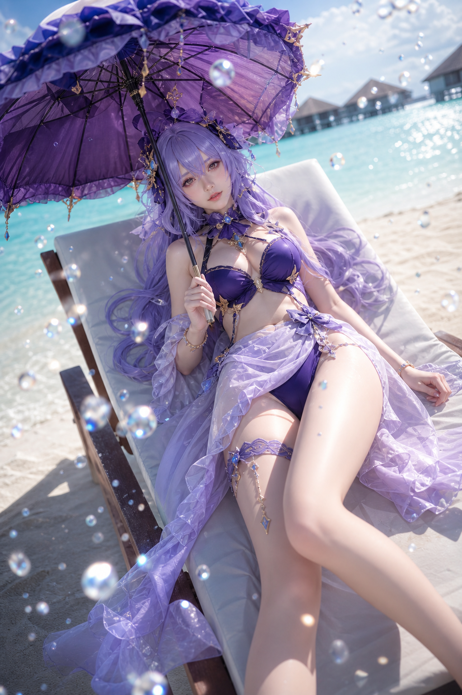

# Person Image Prompt Gate

[English README](README_EN.md)

一个用于 Codex 的人物生图提示词审核 Skill。它会在生成角色图、COS 图、人物海报、立绘、插图前，先按「9 模块人物提示词方法」检查提示词是否完整、是否存在镜头、动作、造型、年龄、多人风险等冲突；通过后再生成，不通过则先给出修改建议。

## 来源与致谢

本 Skill 的方法论整理，受到开源项目 [EvoLinkAI/awesome-gpt-image-2-API-and-Prompts](https://github.com/EvoLinkAI/awesome-gpt-image-2-API-and-Prompts) 的启发。

感谢原项目作者和社区贡献者公开分享大量 GPT-Image-2 API 与提示词案例。本 Skill 是基于对其中人物生成相关案例的观察、筛选和分析后整理出的工作流，重点服务于人物图提示词审核与生成前校验；仓库不复制原项目的案例图片或完整提示词内容。

如果你需要学习更完整的 GPT-Image-2 API 示例、Prompt 案例与社区贡献，请访问原项目。

## 适用场景

- 动漫角色立绘
- COSPLAY 人物图
- iPhone 随手拍风格的 COS 抓拍图
- 单人角色海报
- 人物插图
- 写实/半写实人物摄影感图
- 游戏/动漫角色的主题变体图

不建议用于多人群像、电商图、广告视觉、产品图、纯风景图或非人物主体图。

## 手机抓拍真实感模式

这个模式用于处理原汁原味的手机随手拍提示词，包括：构图笨拙、镜头倾斜、主体偏离中心、前景遮挡、轻微失焦、运动模糊、镜头油污、JPEG 压缩感、街头或餐厅混合光，以及模糊且不可识别的背景路人或食客。

在这个模式下，Skill 会把“单人约束”理解为“一个清晰主角”。背景人物可以作为氛围存在，但必须是模糊、不可识别、次要的，不能成为新的主体。

这些手机照片里的“不完美”不会单独触发纠错。只有当它们破坏核心目标时，Skill 才会暂停，例如：主角脸部不可读、角色识别点被遮住、背景人物变成清晰副主体，或同时要求“原始手机抓拍”和“精修棚拍大片”。

## 9 模块审核法

Skill 会按以下顺序审核人物图提示词：

1. 图像类型
2. 单人约束
3. 人物身份与脸部
4. 造型系统
5. 场景世界
6. 构图与镜头
7. 动作与肢体语言
8. 光线与色彩
9. 质感与最终画面

如果出现冲突，例如“全身正面站立”同时要求“躺在椅子上”、“第一人称俯视”同时要求“完整正面全身”、或“完全还原原服装”同时要求“泳装改造”，Skill 会暂停生图并给出修正版本。

## 安装

将本仓库复制到 Codex skills 目录：

```powershell
git clone https://github.com/yinxiaosuohun2-code/person-image-prompt-gate.git "$env:USERPROFILE\.codex\skills\person-image-prompt-gate"
```

重启 Codex 后，在对话中调用：

```text
$person-image-prompt-gate
```

或直接提出人物生图需求，并说明需要先审核提示词。

## 真实交互案例

以下案例来自本 Skill 创建过程中的实际对话，已适当精简。它们展示了 Skill 的核心价值：先判断提示词是否能成立，再决定是暂停修改还是直接生图。

### 案例 1：COS 图，镜头与动作冲突后修正

用户原始需求包含：单人 COS、坎特雷拉、马尔代夫海滩、欧式复古雨伞、深紫色泳装、浅紫薄纱沙滩裙、强烈阳光、水珠折射、电影质感。

审核发现：“第一人称视角站立俯视、全身中景正面”与“角色躺在白色沙滩椅上”存在镜头和动作冲突。修正后保留海滩椅、斜构图、紫色造型和慵懒氛围，去掉不兼容的第一人称站立俯视要求，再生成。



### 案例 2：动漫角色立绘，结构完整后直接生成

用户需求包含：单人动漫电影感角色图、绯雪、红白色泳装、沙滩浅水、全身中景正面、半转回身微笑、强烈阳光、丁达尔光效、发丝高光、水珠、帆船、棕榈树。

审核结果：图像类型、单人约束、角色身份、造型、场景、镜头、动作、光线和负面提示词完整且兼容，因此直接生图。


### 案例 3：角色夏日变体，保留角色识别元素

用户需求包含：鸣潮角色爱弥斯、单人动漫角色立绘、粉色泳装、浅海、三角帆船、迎着阳光飞驰、开怀微笑、远景帆船和棕榈树。

审核重点：泳装改造不能写成“完全原著还原”，而应写成“夏日浅海变体”，保留粉发、角色配色、电子幽灵气质、梦幻科技感和符合角色特点的装饰品。提示词通过后直接生成。


### 案例 4：参考图辅助，成人年龄与动态姿态明确

用户上传了角色参考图，并提出：动漫电影感动态角色插图、单人、成年女性角色、爱弥斯夏日浅海变体、22+、粉色泳装、冲浪板、全身中景正面、对角线构图、清晰剪影、强烈阳光、飞溅水珠和电影质感。

审核结果：成人年龄明确，角色变体逻辑成立，动态动作与镜头兼容，背景元素有层次，负面提示词覆盖多人、拼图、文字、水印、畸形手和低质量风险，因此直接生成。


### 案例 5：参考图辅助的 iPhone 路人视角抓拍

用户上传了角色参考图，并提出：一位成年女性 Cosplayer 走在城市街道前方，突然回头微笑；画面是路人视角的 iPhone 随手拍，带有黄昏黄金时段、坏构图、前景遮挡、相机抖动、轻微失焦、镜头油污和微信画质压缩感。

审核重点：原始提示词要求“双马尾”和“精灵耳”，但参考图没有清晰呈现这些特征。因此实际生成提示词改为保留参考图中可见的识别点：粉色长发、柔和发色渐变、金色眼睛、小银色发饰、蓝紫白学院风服装、金色镶边、黄色蝴蝶结、宝石胸针和温柔优雅的角色神韵。抓拍里的不完美被保留为真实感特征，同时负面提示词保护脸部可读性、肢体结构和“一个清晰主角”。


实际生成提示词和纠错说明：[examples/candid-aemeath-iphone-snapshot-prompt.md](examples/candid-aemeath-iphone-snapshot-prompt.md)

完整修改说明：[CHANGELOG.md](CHANGELOG.md)

## 最小使用模板

```text
$person-image-prompt-gate
图像类型：[动漫角色立绘 / COS 图 / 人物海报 / 插图]
单人约束：单人，成年角色
人物身份：[角色名、年龄、脸部、发型、表情、气质]
造型系统：[服装、颜色、材质、装饰、道具、角色识别元素]
场景世界：[地点、时间、背景元素、世界观线索]
构图与镜头：[全身/半身/近景、正面/侧面/俯视、焦点、背景虚化]
动作与肢体：[站立、奔跑、回身、坐姿、手部动作、情绪]
光线与色彩：[阳光、霓虹、闪光灯、轮廓光、色调]
质感与最终画面：[皮肤、头发、布料、水珠、电影感、清晰度]
Negative: no extra people, no collage, no grid, no text, no watermark, no deformed hands.
```

## 许可

请根据你的发布需求选择合适的开源许可证，例如 MIT License。原项目的内容与许可证请以其仓库页面为准。
