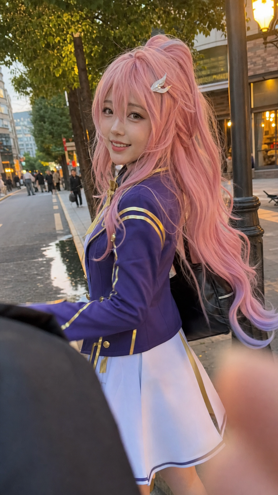

# Candid Aemeath iPhone Snapshot Prompt

This example demonstrates the `Candid Snapshot Realism Mode` added to the Skill.

The original user prompt intentionally requested a raw iPhone snapshot with awkward cropping, foreground occlusion, slight misfocus, motion blur, lens smudge, JPEG artifacts, and blurred background pedestrians. These are treated as intended realism features, not as quality failures.

## Correction Notes

- The user requested "twin tails" and "elf ears", but the reference image does not clearly show twin tails or elf ears.
- The generation prompt therefore preserved the visible reference cues instead: long flowing pink hair, soft hair gradients, golden eyes, small silver hair ornament, blue-purple and white academy-style outfit, gold trim, yellow bow, jewel brooch, and gentle elegant character vibe.
- The prompt kept one clear adult main subject while allowing blurred, non-identifiable background pedestrians.
- The negative prompt was adjusted for candid realism: light motion blur, awkward crop, lens smudge, and compression artifacts are allowed, but unreadable identity, heavy blur on the face, duplicate subjects, and broken anatomy are blocked.

## Generated Image



## Actual Generation Prompt

```text
Use the attached reference image as the strict identity and costume reference. Create a raw candid iPhone snapshot from a passerby / first-person phone perspective, one clear adult female main subject only: an adult female cosplayer walking ahead on a city street, recreating the reference character with extremely strict identity match. Preserve the recognizable character cues from the reference: long flowing pink hair with soft gradients, golden eyes, delicate anime-realism face proportions, the same small silver hair ornament, the same blue-purple and white academy-style outfit structure with gold trim, yellow bow, jewel brooch, white dress panel, blue jacket, gold buttons, and the same gentle elegant character vibe. Do not make her a generic influencer face.

Face and realism: very attractive but natural anime-realism beauty, visible pores with light smoothing, light natural makeup, soft blush on cheeks and nose, slightly dewy skin from walking and golden-hour warmth, natural flush from cool evening air, tiny imperfections such as light sweat sheen and uneven skin texture, not overly perfect or plastic. Expression: she was walking just ahead, then suddenly turns her head back over her shoulder mid-step, with a spontaneous warm fleeting smile, eyes slightly crinkled with genuine delight, slightly surprised but happy, like she just noticed a friend taking a photo. Natural candid street moment, not posed.

Hair and outfit motion: hair slightly messy from walking and gentle evening breeze, a few strands blown across her face or near her lips, subtle motion blur on the flowing hair ends, hair volume tousled and alive. The costume is a faithful real-fabric cosplay replica of the reference outfit, realistic wrinkles, hem and sleeves swaying from walking, small accessories slightly shifted by movement.

Pose: body still facing forward in a walking stride, torso and head naturally turned back toward the camera, one arm mid-swing, the other loosely brushing hair aside or holding a bag strap, relaxed posture, frozen in motion, no deliberate pose.

Scene: early evening golden hour on a lively but relatively clean city sidewalk or neighborhood street. Street lamps just beginning to glow, warm storefront window light in the background, brick wall, leafy tree, or softly lit shop entrance behind her. A few other pedestrians are visible only as naturally blurred, non-identifiable background shapes. Soft golden sunlight casts long shadows and warm tones, subtle backlight creates a faint rim light around her hair and shoulders, reflections from a small puddle or polished storefront, slightly hazy romantic atmosphere.

Camera and composition: raw iPhone snapshot, shot from slightly behind and to one side. The subject is ahead and off-center, awkwardly cropped, lower legs or part of the lower costume accidentally cut off by the frame edge, slightly tilted angle. Foreground first-person phone perspective dominates: blurry edge of phone case or photographer finger in one corner, a companion shoulder or arm partially blocking the lower frame, maybe the edge of a passerby's bag or umbrella, all out of focus with motion blur.

Camera artifacts: bad composition, visible camera shake and subject motion blur from her turning movement, slightly soft focus but the face and identity remain readable, visible grain, WeChat-style JPEG compression artifacts, faint lens smudge or greasy blur, finger slightly covering a corner, slight lens distortion.

Lighting and finish: mixed lighting from golden-hour sunset, cool ambient shadows, and warm early street lamp glow. Slightly uneven exposure, faint atmospheric lens flare from backlight, warm highlights on skin, hair, and fabric. Subtle dust motes or light streaks in the air, minor occlusion by street elements such as a lamp post, street sign, or passing pedestrian.

Mood: a spontaneous real-life street capture, warm, playful, fleeting, full of ordinary city atmosphere and golden-hour warmth. Style: authentic iPhone candid snapshot, not professional photography, not staged, not studio, natural street snap with story.

Negative: no duplicate main subject, no extra clear foreground subject, no collage, no grid, no product ad, no readable text, no watermark, no deformed face, no distorted eyes, no extra limbs, no broken hands, no unreadable identity, no heavy blur on the face, no face fully covered, no overly polished studio lighting, no plastic skin.
```
